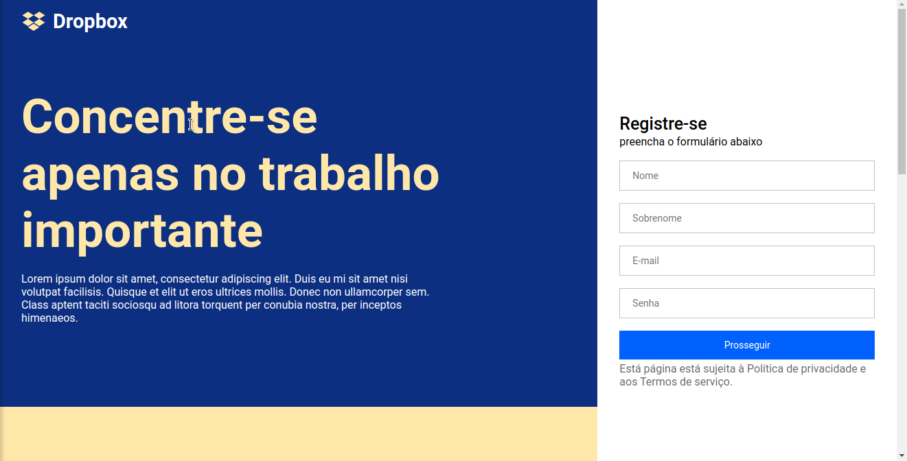
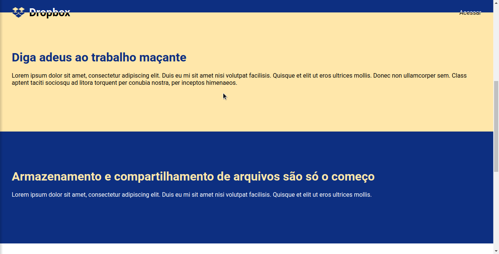

# 🗃 Dropbox UI Clone

## 📋 Sumário

- [🗃 Dropbox UI Clone](#-dropbox-ui-clone)
  - [📋 Sumário](#-sumário)
  - [📖 Sobre](#-sobre)
  - [👁 Pré-visualização](#-pré-visualização)
  - [🛠 Tecnologias utilizadas](#-tecnologias-utilizadas)
  - [⚙ Como executar o projeto](#-como-executar-o-projeto)

## 📖 Sobre

Clone da interface do Dropbox, seguinto tutorial da [Rocketseat](https://rocketseat.com.br).

## 👁 Pré-visualização

<p align="center">
  
</p>

<p align="center">
  
</p>

## 🛠 Tecnologias utilizadas

- [ReactJS](https://reactjs.org/)
- [TypeScript](https://www.typescriptlang.org/)

## ⚙ Como executar o projeto

- Clone o repositório:

  ```sh
  git clone https://github.com/DarkTechLC/dropbox-ui-clone-reactjs.git
  ```

- Mude para o diretório do repositório clonado:

  ```sh
  cd dropbox-ui-clone-reactjs
  ```

- Instale as dependências:

  ```sh
  npm install
  ```

- Execute o projeto:

  ```sh
  npm start
  ```

> Esse projeto está sob licença [MIT](LICENSE).
